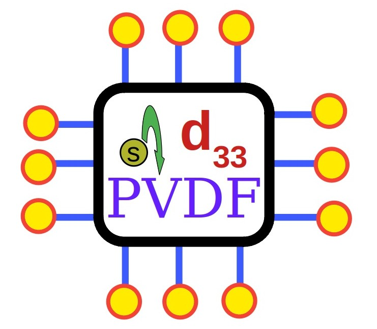

# Informatics based study of Dopants on efficiency of PVDF fabricated through various routes

Text based data extraction from web using attention mechanism

 (Type A: Normal Speed)

 (Type B: numba acceleration wherever applicable, more keyterms on materials science of doped and electrospun PVDF)

  (Enhancement of r0 version with provision of download of pdf and universe db files, Type A)

 (Type B)

 (Type B, Robust)

  (Type A)

  (Type A)

  (Type A, Working)

 (Type B, Robust, Advanced r6)

 (Type B, Robust, Advanced r6)

 (Type B, Robust, Advanced r6, Smart Query can be Given to the ML model)

 (Type B, Robust, Advanced r6, Smart Query can be Given to the ML model, Enhanced Features for Database Processing)

 (For Small Data, Type B, Robust, Advanced r13, Smart Query can be Given to the ML model, Enhanced Features for Database Processing, this code has been implemented for the paperwork)

 (For Big Data, Type B, Robust, Advanced r14, Smart Query can be Given to the ML model, Enhanced Features for Database Processing)

 (For Big Data, Type B, Robust, Finetuned r15, Smart Query can be Given to the ML model, Enhanced Features for Database Processing)

# Data Visualization and Quantitative NER

  (working)

  (working, conceptualization of generative model)

  (working, conceptualization of generative model, numba acceleration)

# Wordcloud 

  

  

# Visualizations in terms of charts

  

 (this code has been implemented for the paperwork) 

  

 

# How to Cite This Work:

Poudel, S., Smok, W., Thapa, R., Timofiejczuk, A., Moelans, N., & Kunwar, A. (2026). Physics-guided machine learning for enhanced piezoelectric performance in electrospun PVDF/SnO2 nanofibers. Sustainable Materials and Technologies, e02008. https://doi.org/10.1016/j.susmat.2026.e02008

